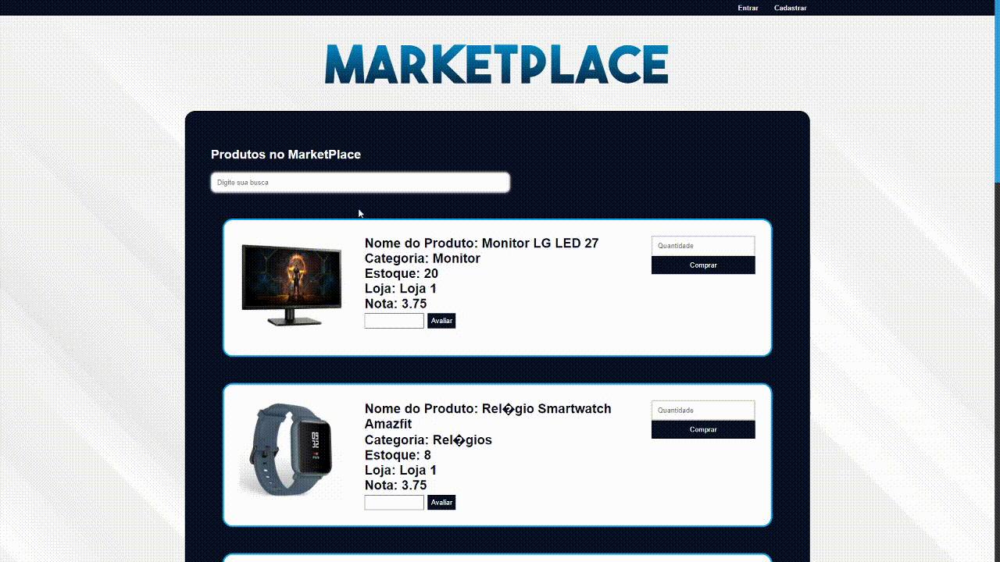
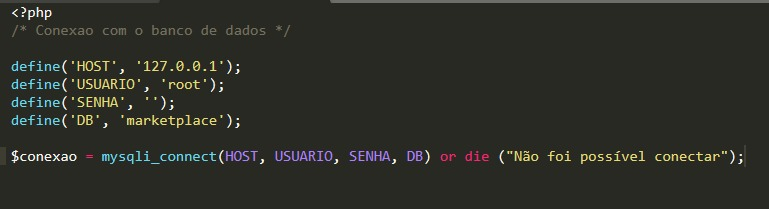

<h1 align="center">
Marketplace
</h1>

<h1>
	
</h1>

<h2 align="center">
	<a href="http://lucasanastacio.ga/html/index.php"> Acessar a demonstração online </a>
</h2>


## 📃 Sobre

O projeto é um **Marketplace** que foi desenvolvido com o intuito de demonstrar todas os conhecimentos e habilidades.

---

## ✒ Tecnologias utilizadas

O projeto foi desenvolvido utilizando as seguintes tecnologias:

- HTML5
- CSS3
- JavaScript
- PHP
- SQL

---

## Como baixar o projeto

```bash
	# Clonar o repositório
	$ git clone https://github.com/lucasar2303/MarketPlace

	# Entrar no diretório
	$ cd MarketPlace

	# Instalar as dependências
	$ yarn install

	# Iniciar o projeto
	$ yarn start
```

## Conectando o banco de dados

No arquivo 'conexao.php' troque as credenciais do banco:
- HOST
- USUARIO
- SENHA
- DB



Desenvolvido por Lucas Anastácio 😆